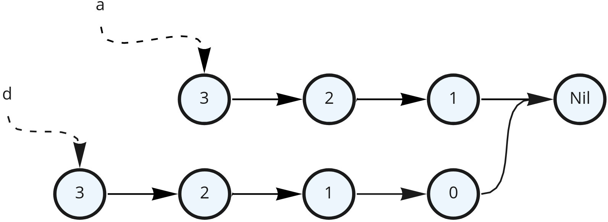
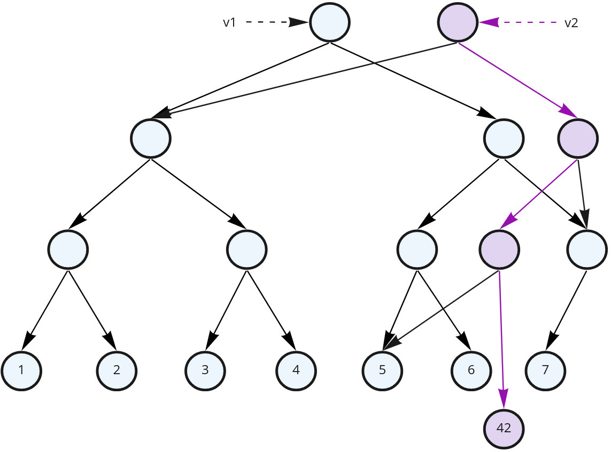

# За какво ще говорим

::: incremental

* Рекурсия
  * Опашкова рекурсия, практични примери
* Неизменимост и неизменими структури от данни
* Функциите като първокласни обекти
  * ламбда фунцкии и функционален тип
  * Функции от по-висок ред - `map`, `filter`, `foldLeft` и други
  * Currying - защо и кои са средствата, които Скала ни дава
* Композиция на функции
* Изразяване чрез типове

:::

# Рекурсия

::: incremental

* Функция, която извиква себе си
  
  { height=200 .fragment }
* Използва се за постигане на цикличност. Често срещано във ФП
* Избягва мутиране на състояние
* По-естествен начин за описване на определени алгоритми. Пример - fact
  ```scala
  def fact(n: Int): Int =
    if (n <= 1) 1
    else n * fact(n - 1)
  ```

:::

# Примери

```scala
def sum(l: List[Int]): Int

def size[A](l: List[A]): Int

def fibonacci(i: Int): Int
```

# Unfolding the recursion

::: incremental

* Използвайки substitution model
  
  ```
  fact(5)
  --
  5 * fact(5 - 1) =
  --
  5 * fact(4) =
  --
  5 * (4 * fact(4 - 1)) =
  --
  5 * (4 * fact(3)) =
  --
  5 * (4 * (3 * fact(3 - 1))) =
  --
  5 * (4 * (3 * fact(2))) =
  --
  5 * (4 * (3 * (2 * fact(2 - 1)))) =
  --
  5 * (4 * (3 * (2 * fact(1)))) =
  --
  5 * (4 * (3 * (2 * 1)))
  ```

* ако извикаме функцията с `Int.MaxValue` ще получим `java.lang.StackOverflowError`

:::

# Опашкова рекурсия (tail recursion)

::: incremental

> "A recursive function is tail recursive when recursive call is the last thing executed by the function."

:::

# Примери

::: incremental

```scala
def fact(n: Int, acc: Int = 1): Int =
  if (n <= 1) acc
  else fact(n - 1, acc * n)
```

<div class="fragment">

И какво от това?

</div>

:::

# Как изглежда стека тогава?

```
fact(5, 1)
--
fact(5 - 1, 5 * 1) =
--
fact(4, 5) =
--
fact(4 - 1, 5 * 4) =
--
fact(3, 20) =
--
fact(3 - 1, 20 * 3) =
--
fact(2, 60) =
--
fact(2 - 1, 60 * 2) =
--
fact(1, 120) =
--
120
```

# Ето какво

::: incremental

* Няма нужда да пазим променливи в стека от предните извиквания
* "Tail recursive" функциите могат да бъдат оптимизирани от компилатора
* accumulator подход
* @tailrec

:::

# Още примери

Нека преправим предните примери с опашкова рекурсия

```scala
def sum(l: List[Int]): Int

def size[A](l: List[A]): Int

def fibonacci(i: Int): Int
```

# Обхождане на списък

* drop
* reverse
* take 
* nth element
* concat

# Неизменимост

# Неизменими обекти във времето

```scala
case class Person(name: String, age: Int, address: Address)
case class Address(country: String, city: String, street: String)

def getOlder(person: Person): Person = person.copy(age = person.age + 1)

val youngRadost = Person("Radost", 24, Address("Bulgaria", "Veliko Tarnovo", "ul. Roza"))
val olderRadost = getOlder(radost)
```

::: { .fragment }

Неизменимосттa ни позволява:

::: incremental

* Persistence (персистентност)
  - и двата обекта (`youngRadost` и `olderRadost`) остават валидни
* Structural sharing
  - и споделят голяма част от вътрешните си обекти

:::

:::

# Неизменими обекти във времето

```scala
case class Person(name: String, age: Int, address: Address)
case class Address(country: String, city: String, street: String)

def getOlder(person: Person): Person = person.copy(age = person.age + 1)

val youngRadost = Person("Radost", 24, Address("Bulgaria", "Veliko Tarnovo", "ul. Roza"))
val olderRadost = getOlder(radost)
```

{ height=380 }

# Неизменими структури от данни -- списък

```scala
val a = List(3, 2, 1)
```

::: { .fragment }

{ height=120 }

:::

# Неизменими структури от данни -- списък

```scala
val a = List(3, 2, 1)
val b = 4 :: a
val c = 5 :: a.tail
```

::: { .fragment }

{ height=240 }

:::

::: incremental

* Persistence
* Structural sharing
* Ако някоя променлива излезе от scope GC ще се погрижи за ненужните части

:::

# Списък от цели числа

```scala
trait IntList {
  def head: Int
  def tail: IntList
}

case class Cons(head: Int, tail: IntList) extends IntList
case object Nil extends IntList {
  def head = throw new NoSuchElementException
  def tail = throw new UnsupportedOperationException
}
```

::: { .fragment }

```scala
val xs = Cons(1, Cons(2, Cons(3, Nil)))
xs.tail.head // 2
```

:::

# Добавяне на елемент в края на списък

```scala
val a = List(3, 2, 1)
val d = a :+ 0
```

::: { .fragment }

{ height=240 }

:::

::: { .fragment }

Тук вече няма как да споделим общите елементи

:::

# Вектор -- оптимизация за произволен достъп

```scala
val v1 = Vector(1, 2, 3, 4, 5, 6, 7)
```

::: { .fragment }

{ height=380 }

:::

::: { .fragment }

балансирано дърво

:::

# Вектор -- операции

```scala
val v1 = Vector(1, 2, 3, 4, 5, 6, 7)
v1.head // 1
v1.last // 7
v1(4) // 5

// Трите операции имат еднаква сложност
```

::: { .fragment }

{ height=380 }

:::

# Вектор -- замяна на елемент

```scala
val v1 = Vector(1, 2, 3, 4, 5, 6, 7)
val v2 = v1.updated(5, 42)
```

::: { .fragment }

{ height=420 }

:::

# Вектор

::: incremental

* Дърво с 32 деца на всеки възел
* Така повечето му операции са със сложност log<sub>32</sub>n
  - Което се смята за почти константа ([ефективно константа](https://docs.scala-lang.org/overviews/collections/performance-characteristics.html))
* Полезно ако имаме нужда от произволен достъп
* Имплементира Radix Balanced Tree
* Примери за още операции [тук](https://docs.google.com/presentation/d/1GY0p2P-BzPfWspKoMRxOQ87fG01t4oMJ1PJxjxGFurQ/edit)

:::

# Чисто функционални структури от данни

::: incremental

* Разучаването им започва силно през 90-те
  - ["Purely Functional Data Structures", Chris Okasaki](https://www.cambridge.org/core/books/purely-functional-data-structures/0409255DA1B48FA731859AC72E34D494)
* Популяризирани чрез Clojure
  - ["The Value of Values", Rich Hickey](https://www.infoq.com/presentations/Value-Values/)
* Persistence
* Structural sharing
* Подпогани от GC
* Безопасно споделяне със всяка част от кода
  - дори между нишки 
  - (~)константно създаване на производна структура -- например с допълнителен елемент

:::

# Set и Map

::: incremental

* Подобно на Vector, също използват дърво, по-точно Trie
* [Hash array mapped trie (HAMT)](https://lampwww.epfl.ch/papers/idealhashtrees.pdf)
* От Scala 2.13 -- [оптимизация](https://core.ac.uk/download/pdf/192654061.pdf)
* Повечето им операции също са [ефективно константа](https://docs.scala-lang.org/overviews/collections/performance-characteristics.html)
* До 4 елемента се пазят в масив

:::


# Функциите като първокласни обекти

::: incremental

* Какво означава това?
  * Могат да се използват навсякъде както бихме използвали "нормални" стойности
  * Няма ограничение къде могат да бъдат дефинирани, т.е. като "нормални" стойности
  * Типа им се описва подобно на "нормалните" стойности
* В Scala има Function literals - анонимни функции (ламбда)

:::


# Анонимни функции, a.k.a lambda 

Синтаксис
```scala
val lambdaName = (param:Type) => expression
```

<div class="fragment">

```scala
val addOne = (x: Int) => x + 1
val sum = (x: Int, y: Int) => x + y

// или така
val addOne: Int => Int = x => x + 1
val sum: (Int, Int) => Int = (x, y) => x + y

// Извикват се по стандартния начин
addOne(41) // 42
sum(40, 2) // 42
```

</div>


# Функционален тип

::: incremental

* Функциите са обекти, които също си имат тип.
* Когато дефинираме следната функция
  ```scala
  val lessThan = (a: Int, b: Int) => a < b
  ```
* всъщност се дефинира обект от тип `Function2` с метод `apply`
  ```scala
  val lessThan = new Function2[Int, Int, Boolean] {
    def apply(a: Int, b: Int): Boolean = a < b
  }
  ```
* `Function2` e нормален `trait` - репрезентира функции на два аргумента
* Съществуват подобни за функции на различен брой аргументи - `Function0` ... `Function22`

:::

# apply? - от предния път 

::: incremental

* Метод `apply` е специален. Обектите, които го имат могат да бъдат извиквани като функции

<div class="fragment">

```scala
class Adder(a: Int) {
  def apply(b: Int) = a + b
}

val oneAdder = new Adder(1)
oneAdder(2)
// res2: Int = 3
  ```

```scala
def makeAdder(a: Int) = (b: Int) => a + b

val oneAdder = makeAdder(1)
oneAdder(2)
// res2: Int = 3
```

</div>

:::

# Eta expansion

Преобразуване на метод към функция

  ```scala
  def sum(a: Int, b: Int) = a + b

  val sumFun = sum  // doesn't work, will work in Scala 3
  
  val sumFun = sum _  // works

  val sumFun: (Int, Int) => Int = sum   // also works

  val sumFun2: Function2[Int,Int,Int] = sum   // also works

  sumFun(1, 2)
  ```

# Partial application

```scala
val addOne = sum(_, 1)
```

Типът на `addOne` е `Int => Int`

<div class="fragment">

```scala
def wrap(prefix: String, html: String, suffix: String) = prefix + html + suffix

val wrapWithP = wrap("<p>", _, "</p>")
val wrapWithDiv = wrap("<div>", _, "</div>")

wrapWithDiv(wrapWithP("Hello, world"))
// res3: String = "<div><p>Hello, world</p></div>"
```

</div>


# Higher-order functions

::: incremental

* Вече видяхме, че са функциите нормални стойности
* Което означава, че можем да ги подаваме на други функции или да ги връщаме като резултати

<div class="fragment">


> Дефиниция - Функции, които приемат функции като параметри или връщат функции като резултат

</div>

:::

# Пример

```scala
def formatResult(name: String, n: Int, f: Int => Int) = {
  s"The $name of $n is ${f(n)}" 
}

formatResult("factorial", 3, fact)
//res2: String = "The factorial of 3 is 6"

formatResult("+1 addition", 41, addOne)
//res4: String = "The +1 addition of 41 is 42"

```

# HOFs върху списъци

# filter


# filter

```scala
def filter[A](la: List[A], p: A => Boolean): List[A]

// метод на trait Seq
trait Seq[A] {
  def filter(pred: A => Boolean): Seq[A]
  ...
}
```

# Примери

```scala
val l = List(1, 2, 3, 4, 5, 6)
val isEven = (x: Int) => x % 2 == 0

l.filter(isEven)
// res0: List[Int] = List(2, 4, 6)

l.filter(x => x > 3)    // uses Type Inference
// res1: List[Int] = List(4, 5, 6)

```

<div class="fragment">

За създаване на ламбда може да използваме и `_` (placeholder), който ще бъде попълнен с параметър
```scala
l.filter(_ > 3)
// res2: List[Int] = List(4, 5, 6)

List("foo", "bar", "").filterNot(_.isEmpty)
// res3: List[String] = List("foo", "bar")
```

</div>

# map


# map

```scala
def map[A, B](la: List[A], f: A => B): List[B]

// метод на trait Seq
trait Seq[A] {
  def map[B](f: A => B): Seq[B]
  ...
}
```

# Примери

```scala

List(1, 2, 3).map(_ * 2)
// res0: List[Int] = List(2, 4, 6)

List("foo", "bar", "baz").map(wrapWithDiv)
//res1: List[String] = List("<div>foo</div>", "<div>bar</div>", "<div>baz</div>")

List(1, -5, 6, -20).map(_.abs)
//res12: List[Int] = List(1, 5, 6, 20)

List(1, 2, 3).map(sum(_, 1))
//res11: List[Int] = List(2, 3, 4)
```

# Имплементация

```scala

def filter[A](la: List[A], p: A => Boolean): List[A] = ???

def map[A, B](la: List[A], f: A => B): List[B] = ???

```

# chaining

```scala
List("foo", "bar", "bazzzz")
  .filter(_.size < 5)
  .map(wrapWithP)
  .map(wrapWithDiv)

// res0: List[String] = List("<div><p>foo</div></div>", "<div><p>bar</div></div>")
```

# Синтаксис с блок

```scala
val l = List("foo", "bar", "baz")
l.map { s =>
  wrapWithDiv(s)
}
// res0: List[String] = List("<div>foo</div>", "<div>bar</div>", "<div>baz</div>")

List(1, 2, 3)
  .map { x => complexCalc2(x) }
  .filter { c => 
    val limit = getLimit(c)
    c < limit
  }
```

# reduce


# reduce

```scala
def reduce[A](la: List[A], f: (A, A) => A): A

def Seq[A]: Unit = {
  def reduce(op: (A, A) ⇒ A): A
  ...
}
```

# Примери

```scala

List(1, 2, 3).reduce((x, y) => x + y)
// res1: Int = 6

List(5, 10, -50, -100, 200).reduce(Math.min)
// res2: Int = -100

```

<div class="fragment">

Може да използваме `_` и за повече от един параметър

```scala

List(1, 2, 3).reduce(_ + _)
// res1: Int = 6

List(5, 10, -50, -100, 200).reduce(_ max _)
// res2: Int = 200

```

</div>

# Допълнителни ресурси

* [Scala: The Differences Between `val` and `def` When Creating Functions](https://alvinalexander.com/scala/fp-book-diffs-val-def-scala-functions/)
* [Partially-Applied Functions (and Currying) in Scala](https://alvinalexander.com/scala/fp-book/partially-applied-functions-currying-in-scala/)

