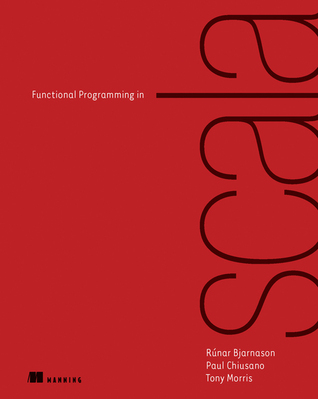

# Предния път – Type classes

:::incremental

* моделират типове
* предоставят общ интерфейс и аксиоми за цяло множество от типове
* или още – общ език, чрез който да мислим и боравим с тези типове
* позволяват ad hoc полиморфизъм
* наблягат на композитността и декларативността
* добавят се ретроактивно към типовете и в Scala могат да бъдат контекстно-зависими

:::

# Днес - Монади и Апликативи


# Ефекти

* Option[A] – частичност
* Try[A] – успех/грешка с изключение
* Either[E, A] – успех/грешки
* Validated[E, A] – валидация с множествено грешки
* List[A] – недетерминизъм, множественост
* IO[A] – вход/изход
* Future[A] – (eager) асинхронност
* Task[A] – (lazy) асихронност
* State[S, A] – състояние

#

Нека да генерализираме познатите ни от тях операции в type class-ове

Предния път постигнахме подобна генерализация за прости типове, нека сега се опитаме да го направим и за ефекти.

<p class="fragment">Ще започнем от една различна гледна точка</p>

# Композиция на функции

Нека имаме функции f: A => B и g: B => C

<p class="fragment">Тогава h(x) = g(f(x)) е функция от тип A => C</p>

<p class="fragment">h = g ∘ f</p>

# Композитност на функции – аксиоми

:::incremental

* асоциативност – нека f: A => B, g: B => C и h: C => D. Тогава:

  ```
  (h ∘ g) ∘ f = h ∘ (g ∘ f)
  ```
* неутрален елемент – нека identity = x => x. Тогава ∀ f

  ```
  identity ∘ f = f ∘ identity = f
  ``` 

:::

# Композитност на функции

h ∘ g ∘ f

# Ефектни функции

Функция, връщаща стойност, затворена в ефект

<div class="fragment">
```
A => Option[B]
A => Future[B]
A => Validated[E, B]
```
</div>

<div class="fragment">
Наричат се още Kleisli arrows
</div>

# Композитност на ефектни функции?

Нека<br />
f: A => Option[B],<br />
g: B => Option[C],<br />
h: C => Option[D]

<p class="fragment">h ∘ g ∘ f?</p>

<p class="fragment">За всеки ефект имплементацията е различна</p>

# Option, ако нямаме `flatMap`

```scala
def compose[A, B, C, D](f: A => Option[B],
                        g: B => Option[C],
                        h: C => Option[D]): A => Option[D] = a => {
  val fOption = f(a)
  if (fOption != None) {
    val gOption = g(fOption.get)
    if (gOption != None){
      h(gOption.get)
    } else {
      None
    }
  } else {
    None
  }
}
```

<p class="fragment">Често срещано при работа с някои езикови елементи (`null`, callback hell код, ...)</p>

# Type class за композиране

# Монада

```scala
trait Monad[F[_]] {
  def compose[A, B, C](f: A => F[B], g: B => F[C]): A => F[C]
  def unit[A](a: A): F[A]
}
```

<p class="fragment">Тук `F` е конструктор на тип, а не тип</p>

<p class="fragment">Пример: List е конструктор на тип, List[Int] е тип</p>

<p class="fragment">`F` е higher-kinded type (тип от по-висок ред)</p>

<p class="fragment">higher-kinded polymorphism</p>

<div class="fragment">
<p>
{ height="130" }
</p>

<p>
[Monads are like burritos](https://blog.plover.com/prog/burritos.html)
</p>
</div>


# Монада – аксиоми

:::incremental

* асоциативност:

  ```
  compose(compose(f, g), h) == compose(f, compose(g, h))
  ```
* неутрален елемент, за който имаме left identity & right identity

  ```
  compose(unit, f) == compose(f, unit) == f
  ```
* Много приличат на аксиомите за моноид, но с функции

<div class="fragment">

> A monad is just a monoid in the category of endofunctors, what's the problem?
>  - [A Brief, Incomplete, and Mostly Wrong History of Programming Languages](http://james-iry.blogspot.com/2009/05/brief-incomplete-and-mostly-wrong.html)

</div>

:::

# Монада за Option

```scala
trait Monad[F[_]] {
  def compose[A, B, C](f: A => F[B], g: B => F[C]): A => F[C]
  def unit[A](a: A): F[A]
}

val optionMonad = new Monad[Option] {
  def compose[A, B, C](f: A => Option[B], g: B => Option[C]) =
    (a: A) => f(a) match {
      case Some(b) => g(b)
      case _ => None
    }
  def unit[A](a: A): Option[A] = Some(a)
}
```

# Алтернативна дефиниция<br />чрез `flatMap`

<div class="fragment">

```scala
trait Monad[F[_]] {
  def flatMap[A, B](fa: F[A])(f: A => F[B]): F[B]
  def unit[A](a: => A): F[A]

  def compose[A, B, C](f: A => F[B], g: B => F[C]): A => F[C]
}
```

</div>


<div class="fragment">

`compose` се изразява чрез `flatMap` като:

```scala
def compose[A, B, C](f: A => F[B], g: B => F[C]): A => F[C] =
  a => flatMap(f(a))(g)
```

`flatMap` може да се изрази чрез compose като:

```scala
compose((_: Unit) => fa, f)(())
```

</div>


# Аксиомите чрез `flatMap`

* асоциативност:

  Нека `m: F[A]` и `f: A => F[B]`, `g: B => F[C]`. Тогава

  ```
  m.flatMap(f).flatMap(g) == m.flatMap(a => f(a).flatMap(g))
  ```
* ляв идентитет:

  `∀a: A и f: A => F[B]` е изпълнено: `unit(a).flatMap(f) == f(a)`
  

* десен идентитет:

  `∀m: F[A]` е изпълнено: `m.flatMap(unit) == m` 

#

Нека имплементираме още няколко допълнителни операции към монадата - `exercises/effects/Monad.scala` 

# Maybe

Наша имплементация на Option - ще използваме името `Maybe` за да избегнем колизия с името от стандартната библиотека

#

`unit`, `map` и `flatten` (aka `join`) са трети възможен набор от основни операции

# Но какво точно е Монада?

::: incremental

* Видяхме, че има няколко възможни набори от основни операции
  - `unit` и `flatMap` 
  - `unit` и `compose`
  - `unit`, `map`, и `flatten`
  
* Освен това имаме 2 закона, които могат да бъдат формулирани по няколко начина - за асоциативност и идентитет
  
* По-ясна дефиниция от предната:

<div class="fragment">

> A monad is an implementation of one of the minimal sets of monadic
combinators, satisfying the laws of associativity and identity.

</div>

* Всъщност се разбират много по-добре в даден контекст - с примери

:::

# Id монада

::: incremental

`effects/id/Id.scala`

* Тук ефекта на `flatMap` за `Id` е просто именуване на стойности (variable substitution)
* monads provide a context for introducing and binding variables, and performing variable substitution.

:::

# State монада

`effects/state/State.scala`

# Генерализация на монадите – функтори

```scala
trait Functor[F[_]]  {
  def map[A, B](fa: F[A])(f: A => B): F[B]
}
```

<div class="fragment">

```scala
trait Monad[F[_]] extends Functor[F] {
  def flatMap[A, B](fa: F[A])(f: A => F[B]): F[B]
  def unit[A](a: A): F[A]

  def map[A, B](fa: F[A])(f: A => B): F[B] =
    flatMap(fa)(a => unit(f(a)))
}
```

</div>

# Аксиоми

* Идентитет

```scala
map(x)(a => a) == x
```

# Еквиваленти в Cats

`monads/effects/cats/MonadExample`

# Грешни състояния на монади

Някои монади си имат и грешни състояния, които биха прекъснали цялата композиция

Примери:

* `Option` - `None`
* `Either` - `Left(error)`
* `Try` - `Failure(throwable)`

# Грешни състояния на монади

Композицията става по-трудна ако работим с библиотеки, които ползват
различни монади за връщане на грешките

```scala
def readFile(): Try[String] = ???

def toJson(str: String): Either[Throwable, Json] = ???

for {
    fileContent <- readFile()
    parsedFile <- toJson(fileContent)  //does not compile
} yield parsedFile 
```

Това също може да се генерализира като използваме `MonadError[F[_], E]`,
  но няма да го разглеждаме подробно. Повече детайли [тук](https://blog.codacy.com/error-handling-monad-error-for-the-rest-of-us/#:~:text=MonadError%20is%20a%20type%20class,of%20the%20MonadError%20type%20class.)


# Валидиране и натрупване на грешки

::: incremental

* Нека разгледаме примера от домашното и се опитаме да използваме монада за Validated
* Можем да получим друга абстракция ако използваме `unit` & `map2` за основни операции

:::

# Applicative

```scala
trait Applicative[F[_]] extends Functor[F] {

  // primitive
  def map2[A, B, C](fa: F[A], fb: F[B])(f: (A, B) => C): F[C]
  def unit[A](a: => A): F[A]

  // derived
  def map[A, B](fa: F[A])(f: A => B): F[B] = map2(fa, unit(()))((a, _) => f(a))
  
}
```

# Разликите между Monad и Applicative

Applicative
```scala
val F: Applicative[Option] = ???

val depts: Map[String, String] = ???
val salaries: Map[String, Double] = ???

// two independent lookups
val o: Option[String] =
  F.map2(depts.get("Alice"), salaries.get("Alice"))(
    (dept, salary) => s"Alice in $dept makes $salary per year"
  )
```

# Разликите между Monad и Applicative

Monad
```scala
val F: Monad[Option] = ???

val idsByName: Map[String, Int] = ???
val depts: Map[Int, String] = ???
val salaries: Map[Int, Double] = ???

// the results of one lookup affect what lookup we do next
val o: Option[String] =
  idsByName.get("Bob").flatMap { id =>
    F.map2(depts.get(id), salaries.get(id))(
      (dept, salary) => s"Bob in $dept makes $salary per year"
    )
  }
```

# Разликите между Monad и Applicative

::: incremental

* Монадата добавя допълнителни възможности над Applicative - `join` или `flatMap`
* С апликатива може да комбинираме независими стойности, докато с монадата
  моделираме зависимост между такива.
* С апликатива структурата на програмата е фиксирана,
  а с монадата резултатите от предните изчисления могат да повлияят
  кои изчисления да се изпълняват по-нататък.
* Монадата е sequential, докато апликатива ни дава възможност за независимост и паралелизъм
* Нека отново разгледаме примера с Validated

:::

# Алтернативна дефиниция<br />чрез `apply`

```scala
trait Applicative[F[_]] extends Functor[F] {
  
  def apply[A, B](fab: F[A => B])(fa: F[A]): F[B]
  def unit[A](a: => A): F[A]

}
```

`apply` може да се изрази чрез `map2`, както и обратното
```scala
def apply[A, B](fab: F[A => B])(fa: F[A]): F[B] = map2(fab, fa)(_(_))

def map2[A,B,C](fa: F[A], fb: F[B])(f: (A, B) => C): F[C] =
  apply(map(fa)(f.curried))(fb)
```

# Аксиомите за Applicative

::: incremental

* Очакваме аксиомите на функтор да се спазват
* Ляв и десен идентитет
  ```scala
    map2(unit(()), fa)((_,a) => a) == fa
    map2(fa, unit(()))((a,_) => a) == fa
  ```
* Асоциативност
  ```scala
    product(product(fa,fb),fc) == map(product(fa, product(fb,fc)))(assoc)
  ```
* Натуралност
  ```scala
    map2(a,b)(productF(f,g)) == product(map(a)(f), map(b)(g))
  ```
  където
  ```scala
    def product[A,B](fa: F[A], fb: F[B]): F[(A,B)] =
      map2(fa, fb)((_,_))
    def assoc[A,B,C](p: (A,(B,C))): ((A,B), C) =
      p match { case (a, (b, c)) => ((a,b), c) }
    def productF[I,O,I2,O2](f: I => O, g: I2 => O2): (I,I2) => (O,O2) =
      (i,i2) => (f(i), g(i2))
  ```

:::


# map3, 4 ... N

Бихме могли да дефинираме и повече от `map2`

```scala
def map3[A,B,C,D](fa: F[A], fb: F[B], fc: F[C])(f: (A, B, C) => D): F[D] = {
  val fbcd = map(fa)(f.curried)
  val fcd = apply(fbcd)(fb)
  apply(fcd)(fc)
}
```

<div class="fragment">

```scala
def map4[A,B,C,D,E](fa: F[A],
                    fb: F[B],
                    fc: F[C],
                    fd: F[D])(f: (A, B, C, D) => E): F[E] =
  apply(apply(apply(apply(unit(f.curried))(fa))(fb))(fc))(fd)
```

</div>

# sequence & traverse

Когато не знаем колко е N

```scala
  def sequence[A](lfa: List[F[A]]): F[List[A]] =
    traverse(lfa)(fa => fa)

  def traverse[A,B](as: List[A])(f: A => F[B]): F[List[B]] =
    as.foldRight(unit(List[B]()))((a, mbs) => map2(f(a), mbs)(_ :: _))
```

# sequence & traverse

Примери: `effects/ApplicativeSequenceDemo` & `effects/ApplicativeTraverseDemo`

# Предимства на Applicative

::: incremental

* По-добре е да имплементираме комбинатори като `sequence` & `traverse` използвайки възможно най-малко предположения
* Апликатива е "по-слаб" от монада => имаме повече свобода за имплементация
* Апликативите могат да се комбинират помежду си, докато монадите в общия случай - не

:::

# Traversable

::: incremental

* В дефиницията на `sequence` & `traverse` виждаме конкретен тип, който може да бъде генерализиран
* Това е `List` - нека се абстрахираме от него

:::

# Traversable

```scala
trait Traverse[F[_]] extends Functor[F] {
  def traverse[G[_]: Applicative, A, B](fa: F[A])(f: A => G[B]): G[F[B]]
  
  def sequence[G[_]:Applicative,A](fga: F[G[A]]): G[F[A]] =
    traverse(fga)(ga => ga)
}
```

`traverse` също може да се изрази чрез `sequence`

`map` може да се изрази чрез `traverse`


# Композитност на функтори, монади и апликативи

#


Функторите могат да бъдат композирани:

```scala
import cats.Functor
import cats.implicits._

val listOption = List(Some(1), None, Some(2))
// listOption: List[Option[Int]] = List(Some(1), None, Some(2))

// Through Functor#compose
Functor[List].compose[Option].map(listOption)(_ + 1)
// res1: List[Option[Int]] = List(Some(2), None, Some(3))
```

#

Апликативите също

```scala
import cats.data.Nested
import cats.implicits._
import scala.concurrent.Future
import scala.concurrent.ExecutionContext.Implicits.global

val x: Future[Option[Int]] = Future.successful(Some(5))
val y: Future[Option[Char]] = Future.successful(Some('a'))

val composed = Applicative[Future].compose[Option].map2(x, y)(_ + _)
// composed: Future[Option[Int]] = Future(Success(Some(102)))
```

<p class="fragment">В общия случай монадите не могат да се композират. Но много могат</p>

<p class="fragment">Това води до нуждата от специфични монадни трансформатори</p>

<p class="fragment">Например [`OptionT`](https://typelevel.org/cats/datatypes/optiont.html) за монади от `Option`<br />(тоест `M[Option[_]]`, където `M` е монада)</p>

# Functional Programming in Scala

[{ height="520" }](https://www.manning.com/books/functional-programming-in-scala)

# Теория на категориите

[{ height="520" }](https://github.com/hmemcpy/milewski-ctfp-pdf)
