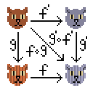
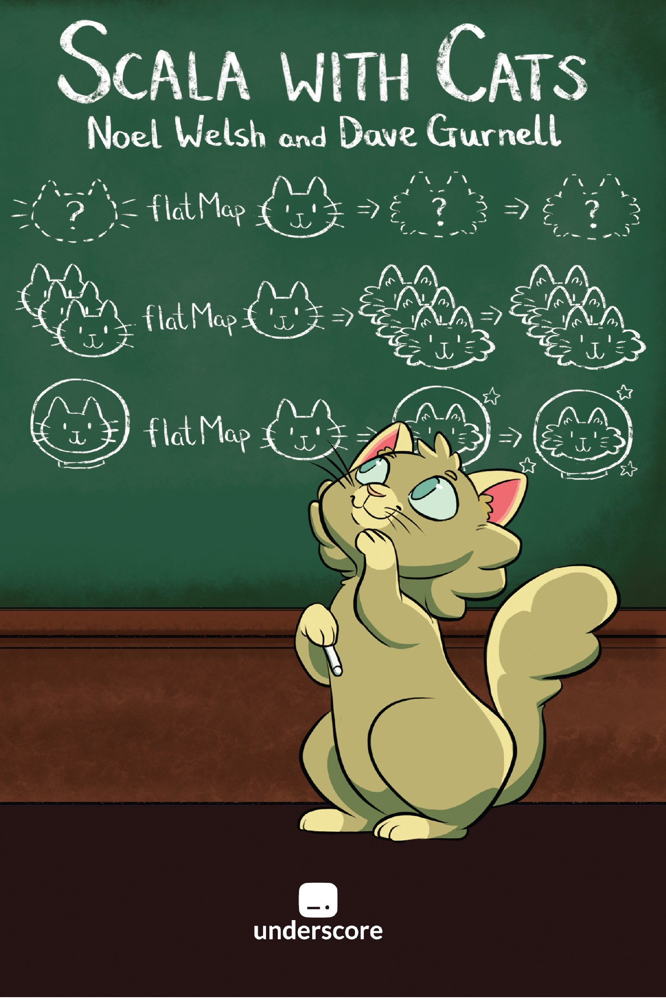

#

[{ width=520 }](https://typelevel.org/projects/)

# Cats { height=64 style="vertical-align: middle" }

[](https://typelevel.org/cats/)

# Cats Book

[{ height=520 }](https://www.scalawithcats.com/)

# Cats

Предоставя:

* [Type class-ове](https://typelevel.org/cats/typeclasses.html)
* Инстанции на тези type class-ове
* [Синтаксис](https://typelevel.org/cats/nomenclature.html) (предимно под формата на extension methods)
* [Data types](https://typelevel.org/cats/datatypes.html)
* [тестване на аксиоми](https://typelevel.org/cats/typeclasses/lawtesting.html)

# Data types

* [Chain](https://typelevel.org/cats/datatypes/chain.html)
* [Validated](https://typelevel.org/cats/datatypes/validated.html)
* [Id монада](https://typelevel.org/cats/datatypes/id.html)
* [State монада](https://typelevel.org/cats/datatypes/state.html)
* `FunctionK` (a.k.a. `~>`), `Nested`, `Free` –<br />ще разгледаме допълнително
* ...

# Синтаксис

# Синтаксис – Option

```scala
import cats.syntax.option._

val maybeOne = 1.some // Some(1): Option[Int]
val maybeN = none[Int] // None: Option[Int]

val either = maybeOne.toRightNec("It's not there :(") // Right(1): Either[String, Int]
val validated = maybeOne.toValidNec("It's not there :(") // Left("..."): Either[String, Int]

val integer = maybeN.orEmpty // 0
```

# Синтаксис – Either и Validated

::: { .fragment }

```scala
import cats.syntax.either._

val eitherOne = 1.asRight
val eitherN = "Error".asLeft

val eitherOneChain = 1.rightNec
val eitherNChain = "Error".leftNec

val recoveredEither = eitherN.recover {
  case "Error" => 42.asRight
}

eitherOneChain.toValidated
```

:::

::: { .fragment }

```scala
import cats.syntax.validated._

val validatedOne = 1.validNec
val validatedN = "Error".invalidNec

validatedOne.toEither
```

:::

# Type class-ове

[Поглед над йеархиите](https://cdn.rawgit.com/tpolecat/cats-infographic/master/cats.svg)

# Сравнение и наредба

::: { .fragment }

```scala
trait Eq[A] {
  def eqv(x: A, y: A): Boolean

  def neqv(x: A, y: A): Boolean = !eqv(x, y)
}
```

:::

# Semigroup и Monoid

```scala
trait Semigroup[A] {
  def combine(x: A, y: A): A
}
```
```scala
trait Monoid[A] extends Semigroup[A] {
  def empty: A
}
```

# Semigroup и Monoid синтаксис

```scala
import cats.syntax.monoid._

1 |+| 2 // 3
"ab".combineN(3) // "ababab"

0.isEmpty // true

Semigroup[Int].combineAllOption(List(1, 2, 3)) // Some(6)
Monoid[Int].combineAll(List(1, 2, 3)) // 6
```

# Тестване на аксиоми

# Foldable

```scala
trait Foldable[F[_]] {
  def foldLeft[A, B](fa: F[A], b: B)(f: (B, A) => B): B
  def foldRight[A, B](fa: F[A], lb: Eval[B])(f: (A, Eval[B]) => Eval[B]): Eval[B]
}
```

#

* Функтор
* Апликатив
* Монада

# Functor

```scala
trait Functor[F[_]] {
  def map[A, B](fa: F[A])(f: A => B): F[B]
}
```

# Apply

```scala
trait Apply[F[_]] extends Functor[F] {
  def ap[A, B](ff: F[A => B])(fa: F[A]): F[B]
  
  def product[A, B](fa: F[A], fb: F[B]): F[(A, B)] =
    ap(map(fa)(a => (b: B) => (a, b)))(fb)

  def map2[A, B, Z](fa: F[A], fb: F[B])(f: (A, B) => Z): F[Z] =
    map(product(fa, fb))(f.tupled)
}
```

# Applicative

```scala
trait Applicative[F[_]] extends Apply[F] {
  def pure[A](x: A): F[A]

  def map[A, B](fa: F[A])(f: A => B): F[B] =
    ap(pure(f))(fa)
}
```

# Traverse

```scala
trait Traverse[F[_]] extends Functor[F] with Foldable[F] {
  def traverse[G[_] : Applicative, A, B](fa: F[A])(f: A => G[B]): G[F[B]]

  def sequence[G[_]: Applicative, A](fga: F[G[A]]): G[F[A]] =
    traverse(fga)(ga => ga)
}
```

# Apply, Applicative, Traverse синтаксис

# FlatMap

```scala
trait FlatMap[F[_]] extends Apply[F] {
  def flatMap[A, B](fa: F[A])(f: A => F[B]): F[B]
}
```

# Monad

```scala
trait Monad[F[_]] extends FlatMap[F] with Applicative[F]
```

# MonadError

```scala
trait MonadError[F[_], E] extends ApplicativeError[F, E] with Monad[F]
```

Абстрактни членове:

```scala
def raiseError[A](e: E): F[A]
def handleErrorWith[A](fa: F[A])(f: E => F[A]): F[A]
```

# FlatMap, Monad и MonadError синтаксис

# Parallel

::: { .fragment }

```scala
trait Parallel[M[_]] extends NonEmptyParallel[M] {
  type F[_]
  
  def applicative: Applicative[F]
  def monad: Monad[M]

  def sequential: F ~> M
  def parallel: M ~> F
}
```

:::

# Композиция на функтор, апликатив и монада

# Композиция на монади – `OptionT` и `EitherT`

::: { .fragment }

[EitherT от лекцията за ефекти](https://github.com/scala-fmi/scala-fmi-2021/blob/master/lectures/07-effects-and-functional-error-handling.ipynb)

:::

# Free Монада:

Повече на следните ресурси:

* [Free as in Monads](https://www.youtube.com/watch?v=aKUQUIHRGec)
* [Composable application architecture with reasonably priced monads](https://www.youtube.com/watch?v=M258zVn4m2M)
* [Free Monads](https://www.youtube.com/watch?v=ycrpJrcWMp4)
