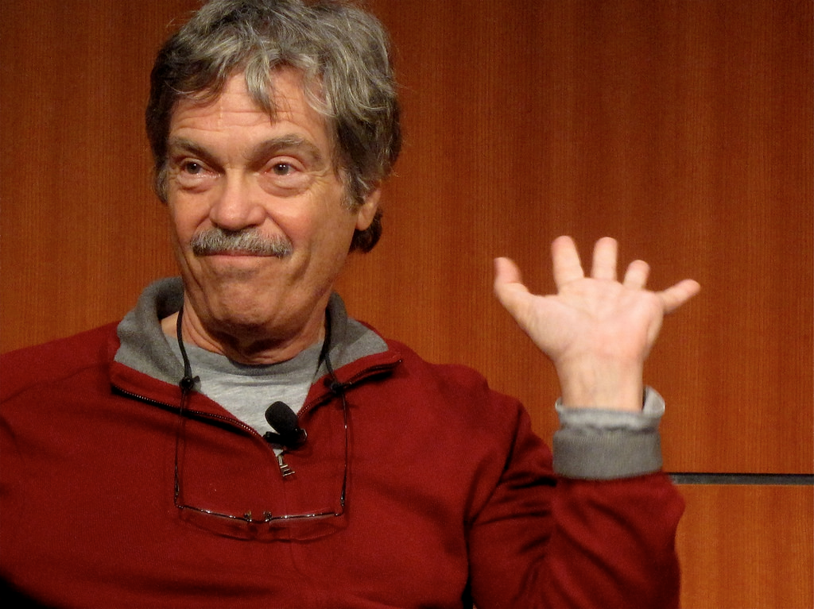
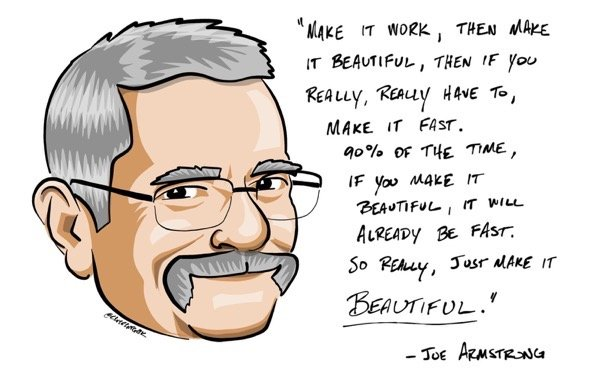
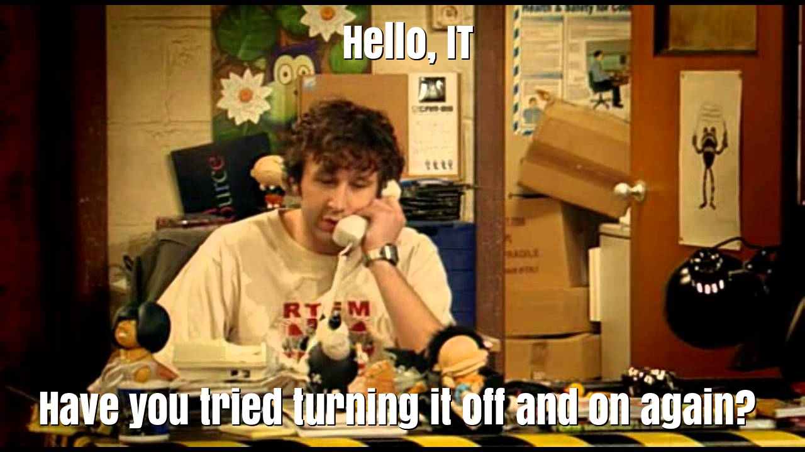
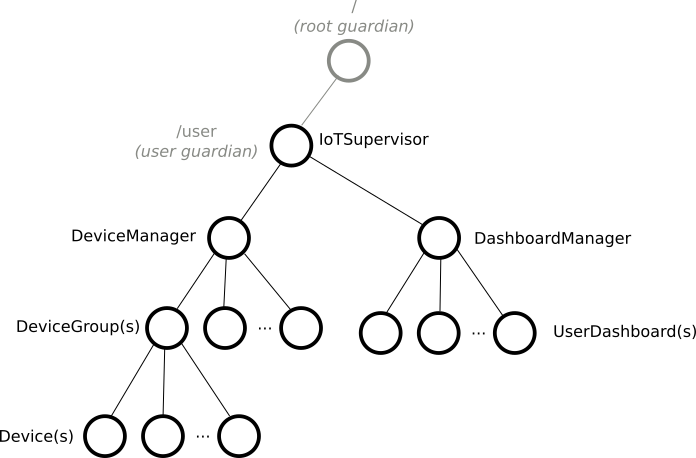

# [Конкурентни модели](08-concurrency.html#/конкурентни-модели/9)

::: { .fragment }

ФП неизбежно ги подпомага

:::

# Актьорски модел ≈ ООП

::: { .fragment }

{ height=480 }

:::

# Актьорски модел ≈ ООП

> “I thought of objects being like biological cells and/or individual computers on a network, only able to communicate with messages… OOP to me means only messaging, local retention and protection and hiding of state-process, and extreme late-binding of all things.” – Alan Kay

# Актьорски модел според Карл Хюит

{ height=280 }

::: incremental

* Математически модел за конкурентни процеси
* Актьорите като универсиални изчислителни примитиви
* Хюит го разглежда като модел на изчисление отвъд модела на Тюринг
* Моделиращ недетерминизма на околния свят

:::

# Актьори

::: incremental

* Всеки актьор изпълнява функционална/Тюринг програма
* Всеки актьор си има “адрес”, на който могат да бъдат изпращани съобщения
* Програмата се нарича “поведение” и се задейства при получаване на съобщение
* Изходът от поведението, обработило съобщението, съдържа:
  - Поведението, което ще бъде изпълнено при следващото съобщение
  - Списък от актьори, които да бъдат създадени, и начално поведение за всеки от тях 
  - Списък от съобщения и съответни адреси на получатели, които те да бъдат изпратени

:::

# С други думи

```scala
trait ActorRef
case class Actor(ref: ActorRef, startingBehavour: Behaviour)
case class Envelope(message: Any, sender: ActorRef, recipient: ActorRef)
type Behaviour = Any => (Behaviour, List[Actor], List[Envelope])
```

# Актьори – недетерминизъм

::: incremental

* Поведението на актьора е детерминирано
* Изпращането на съобщения не. те:
  - могат да бъдат изгубени – няма гаранция, че ще стигнат до получателя
  - могат да пристигнат в произволен ред
  - пристигат след неопределено време
  - моделират недетерминизма на физическия свят

:::

# [Erlang](https://www.erlang.org/)

{ height=384 }
{ height=384 }

#

[](https://akka.io)

# akka (демо)

# Fault tolerance

[Making Reliable Distributed Systems in the Presence of Software Errors](http://erlang.org/download/armstrong_thesis_2003.pdf)<br />by Joe Armstrong

# Supervision tree

::: { .fragment }

{ height=480 }

:::

# Supervision tree

{ height=480 }

# Supervision tree

{ height=480 }

# И още...

# Книжки

[https://doc.akka.io/docs/akka/current/additional/books.html](https://doc.akka.io/docs/akka/current/additional/books.html)

# Въпроси :)?
